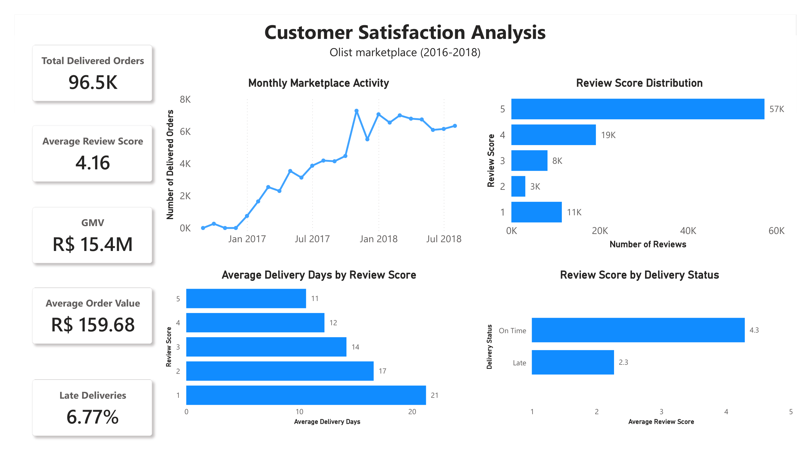

# Olist Customer Satisfaction Analysis

## Dashboard

### Executive Overview

## Project Overview

This project analyzes customer satisfaction on the Olist e-commerce marketplace using SQL, Python, and Power BI.

Main objectives:
- Analyze review score distribution
- Investigate delivery performance
- Examine freight costs
- Evaluate seller performance
- Build an interactive Power BI dashboard

Tools:
- SQL
- Python (Pandas)
- Power BI

## Key Findings

- 77% of reviews received 4 or 5 stars.
- Late deliveries averaged 2.27 stars compared with 4.29 for on-time deliveries.
- Freight cost had only a weak relationship with review score.
- Seller performance was broadly consistent across high volume and other sellers.

## Full Report

Read the complete report here:

📄 **PDF Report:** [Olist Customer Satisfaction Report](report/Olist_Customer_Satisfaction_Report.pdf)
